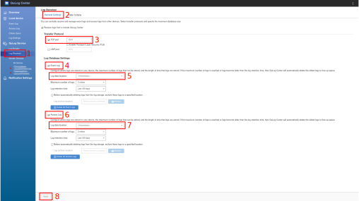
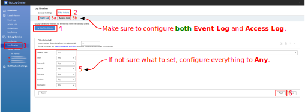
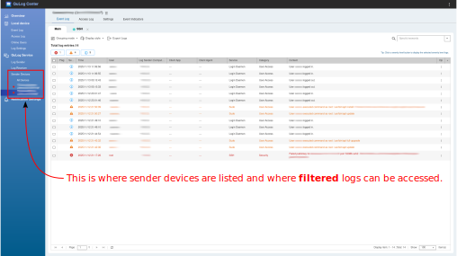

# Java QuLog Center Sender Script

This is small Java utility to send syslog messages from Linux box to QuLog Center Log Receiver
configured on QNAP NAS.

## Why?

Since QNAP QuLog Center Log Receiver message format differs a bit from the standard syslog standard
described in RFC 5424, the classic `logger` command from `util-linux` package cannot be used to send
logs to remote QuLog Center Log Receiver.

The `qulog.java` script has been created to overcome this problem. By communicating directly to the
Log Receiver TCP socket, it sends messages in the format the Log Receiver expects.

## Prerequisites

Install [sdkman](https://sdkman.io/):

```
curl -s "https://get.sdkman.io" | bash
```

Install [JBang](https://sdkman.io/sdks/jbang/):

```
sdk install jbang
```

## Installation

When intention is to use it as a standalone tool, this script does
not require installation. Just download it:

```
wget https://raw.githubusercontent.com/sarxos/qulog-center-sender/refs/heads/master/qulog.java
```

And make sure it is executable:

```
chmod +x ./qulog.java
```

## Installation as a Systemd Service

The `qulog.java journal` can be configured as a systemd service to be launched on the
system startup. There is a dedicated installer to set up everything.

```
$ cd qulog-center-sender
$ tree .
.
├── LICENSE
├── qulog.java
├── README.md
├── rules-sample.js
└── systemd
    ├── install.sh
    ├── qulog.cfg
    ├── qulog.service
    └── qulog-start.sh
```

To install the service, run:

```
systemd/install.sh
```

Configure journal options in `/etc/qulog/qulog.cfg`. The configuration names are
exactly the same as the command line options (long variants, without `--` prefix)
of `qulog.java journal` command.

Example configuration:

```
source = MyLinuxBox
host   = 10.1.2.3
rules  = /etc/qulog/rules.js
```

Where:
* `source` is the source name to appear in QuLog Center (in the left sidebar).
* `host` is the hostname or IP address of the QNAP NAS running QuLog Center Log Receiver.
* `rules` is the path to the JavaScript file with filtering and extraction rules.

Customize filtering and extraction rules in `/etc/qulog/rules.js` (or other location
defined in the configuration file, if changed). See one of the next chapters for more
details about the rules file.

To start the service, run:

```
sudo systemctl start qulog
```

# Usage

## Help

```
./qulog.java --help
```

## Send Test Message

Below will send a single test message to QuLog Center Log Receiver and exit.

```
./qulog.java test \
  -s MyLinuxBox \
  -h 10.1.2.3
  -p 1514 \
  "Test message from My Linux Box to QuLog Center Log Receiver"
```

Where:
* `-h` is the hostname or IP address of the QNAP NAS running QuLog Center Log Receiver.
* `-p` is the TCP port number of the Log Receiver (default is 1514).
* `-s` is the source name to appear in QuLog Center (in the left sidebar, together with MAC).

## Send Jornal Logs Matching Criteria

Below will start reading journalctl logs in JSON format and forward them to the `qulog.java` script.
The script will use `./rules-sample.js` file to filter them, extract some necessary information, and 
send only matching logs to QuLog Center Log Receiver.

```
journalctl -o json -f | ./qulog.java journal \
  -s MyLinuxBox
  -h 10.0.3.4
  -p 1514 \
  -f ./rules-sample.js
```

Where:
* `-f` is the path to the JS file containing filtering and extraction rules.

# QUNAP QuLoG Center Log Receiver Configuration

One need to configure QuLog Center Log Receiver to accept remote logs before attempting
to send any. Without properly configured Log Receiver, all the syslog messages sent to the
QNAP NAS will be simply discarded and will not appear in QuLog Center.

## Log Receiver General Settings



## Log Receiver Filter Criteria



## Sender Devices

All the logs received from remote devices will appear under the _Sender Devices_ section
in the left sidebar of QuLog Center menu.



# Filtering & Extraction Rules File

The rules file is your plain old JavaScript file with a function which is used to filter, extract,
transform, and enrich event logs before sending them to QuLog Center Log Receiver.

The absolute minimum requirement for the rules file is to define a funtion called `filter()`.
This function must return an `object` or `null`. It does not require any arguments.

If functions returns:
* `object` - the log event is sent to QuLog Center, or else if
* `null` - the log event is discarded.

A very simple example:

```javascript
function filter() {

  // filter and record success user logins

  if ($LOG._COMM == 'systemd-logind' && $LOG.MESSAGE.startsWith("New session")) {
    return {
      application: "Logind Service",
      category: "User Access",
      message: "User " + $LOG.USER_ID + " logged in.",
      level: "WARNING",
      user: $LOG.USER_ID,
    };
  }

  // discard all other logs not matching above criteria

  return null;
}
```

All plain old JavaScript features are supported. The only special thing is the `$LOG` variable
which contains the current log record from `journalclt` fromatted a JSON object.

More advanced example with multiple rules, custom extraction functions and enrichment,
can be found in the `rules-sample.js` file included in this repository.

There are some shortcuts available to make writing rules faster and more condensed. For example,
the `application`, `category`, `message`, `level` and `user` properties can be abbreviated.

Valid application property names:
* `application`
* `app`
* `a`

Valid category property names:
* `category`
* `cat`
* `c`

Valid message property names:
* `message`
* `msg`
* `m`

Valid level property names:
* `level`
* `lvl`
* `l`

Valid user property names:
* `user`
* `usr`
* `u`

So this:

```javascript
return {
  application: "Logind Service",
  category: "User Access",
  message: "User " + $LOG.USER_ID + " logged in.",
  level: "WARNING",
};
```

Will work exactly the same as this:

```javascript
return {
  a: "Logind Service",
  c: "User Access",
  m: "User " + $LOG.USER_ID + " logged in.",
  l: "WARNING",
}
```

## Journal Record Format

To see how the `$LOG` objects looks like and to explore available properties, one can open
journal with prettified JSON output:

```
journalctl -o json-pretty
```

Above command will open journal in prettified JSON instead of a regular plain text.

Different services that log to journald may be adding some extra properties which can be
very usefull when extracting information (e.g. `USER_ID` is available only in records
from `systemd-logind`).

Example record from `systemd-logind` service logged when user `testuser` logs in:

```json
{
  "_EXE" : "/usr/lib/systemd/systemd-logind",
  "SESSION_ID" : "21",
  "_SOURCE_REALTIME_TIMESTAMP" : "1763028417355886",
  "USER_ID" : "testuser",
  "_MACHINE_ID" : "416e391fbbad4639a837ee76aa7e003c",
  "_BOOT_ID" : "845b1294e1aa43468ff435f4d7d774f3",
  "_TRANSPORT" : "journal",
  "_COMM" : "systemd-logind",
  "_UID" : "0",
  "_RUNTIME_SCOPE" : "system",
  "_CMDLINE" : "/usr/lib/systemd/systemd-logind",
  "_SYSTEMD_SLICE" : "system.slice",
  "_HOSTNAME" : "my-linux-box",
  "_SYSTEMD_CGROUP" : "/system.slice/systemd-logind.service",
  "CODE_LINE" : "859",
  "MESSAGE_ID" : "8d45620c1a4348dbb17410da57c60c66",
  "SYSLOG_FACILITY" : "4",
  "_GID" : "0",
  "__REALTIME_TIMESTAMP" : "1763028417356088",
  "CODE_FILE" : "src/login/logind-session.c",
  "_PID" : "621",
  "__CURSOR" : "s=f8c24cf278724e70a1c3023a87776422;...",
  "__MONOTONIC_TIMESTAMP" : "48017440519",
  "LEADER" : "4158",
  "_SYSTEMD_INVOCATION_ID" : "b98613e965ef46e68b04e53393bf0635",
  "CODE_FUNC" : "session_start",
  "MESSAGE" : "New session 21 of user testuser.",
  "PRIORITY" : "6",
  "TID" : "621",
  "_CAP_EFFECTIVE" : "24420020f",
  "SYSLOG_IDENTIFIER" : "systemd-logind",
  "__SEQNUM_ID" : "f8c24cf278724e70a1c3023a87776422",
  "__SEQNUM" : "1525",
  "_SYSTEMD_UNIT" : "systemd-logind.service"
}
```

## Properties Extraction Precedence

When a property is not returned in an `object` from `filter()`, the  script will
try to extract it from the original journal log record.

Application name extraction precedence:
1. From `--application` CLI option or, if not present
2. From `application` property in `qulog.cfg` configuration file (if in ENV) or, if not present
3. From `object` returned by `filter()` function or, if not present
4. From `SYSLOG_IDENTIFIER` property in journal record or, if not present
5. From `_COMM` property in journal record or, if not present
6. The application name is set to `Unknown`.

Category name extraction precedence:
1. From `--category` CLI option or, if not present
2. From `category` property in `qulog.cfg` configuration file (if in ENV) or, if not present
3. From `object` returned by `filter()` function or, if not present
4. The category name is set to `General Events`.

User name extraction precedence:
1. From `--user` CLI option or, if not present
2. From `user` property in `qulog.cfg` configuration file (if in ENV) or, if not present
3. From `object` returned by `filter()` function or, if not present
4. From `USER_ID` property in journal record or, if not present
5. From `_UID` property in journal record (converted to username with `id` command) or, if not present
6. The user name is set to `unknown`.

Log level extraction precedence:
1. From `--level` CLI option or, if not present
2. From `level` property in `qulog.cfg` configuration file (if in ENV) or, if not present
3. From `object` returned by `filter()` function or, if not present
4. From `PRIORITY` property in journal record, mapped as:
    * `0`, `1`, `2`, `3` → `ERROR` or
    * `4`, `5` → `WARNING` or
    * `6`, `7` → `INFO` or, if not present
5. The log level is set to `INFO`.

Message extraction precedence:
1. From `object` returned by `filter()` function or, if not present
2. From `MESSAGE` property in journal record or, if not present
3. The record is discarded (not sent to QuLog Center).

# Log Receive RFC 5424 Incompatibilities

When investigating the way QNAP QuLog Center receives messages from remote devices, the following
RFC 5424 incompatibilities were identified:

* The `SD-ID` requirements defined in [Section 6.3.2.](https://datatracker.ietf.org/doc/html/rfc5424#section-6.3.2)
  are not met. The SD used by the QuLog Center is `qulog@event`, but the part after `@` character
  MUST be a private enterprise number as specified in
  (Section 7.2.2.)[https://datatracker.ietf.org/doc/html/rfc5424#section-7.2.2]. When trying to use
  `SD-ID` from QuLog Center, the `logger` utility refuses to accept data.
* RFC 5424 allows the `TIMESTAMP` to contain nanoseconds, see
  [Section 6.2.3.1](https://datatracker.ietf.org/doc/html/rfc5424#section-6.2.3.1) but QuLog Center does not
  seem to accept them. All the ISO 8601 times need to be truncated to seconds.

